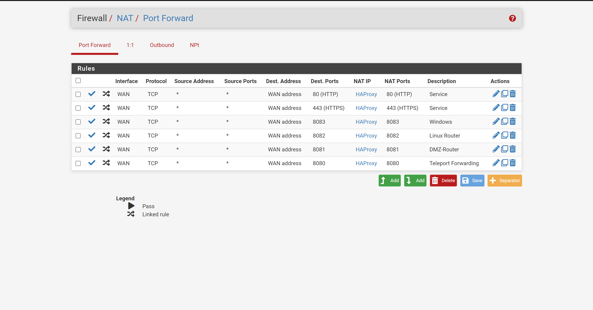
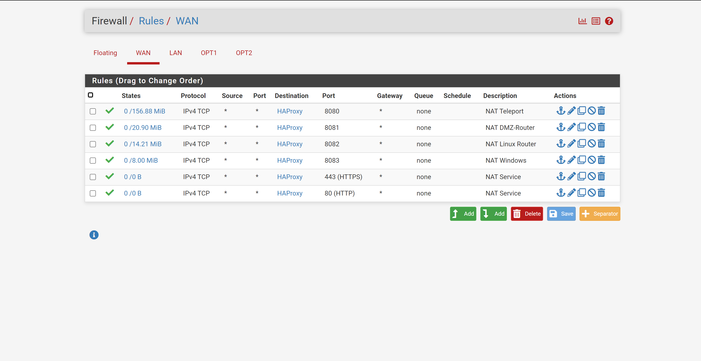

# PFSense Security Configuration  <!-- omit from toc -->

This document will contain further details on the Security configuration done to the PFSense Instances
## Table of Contents <!-- omit from toc -->
- [Exposing Services](#exposing-services)
- [Initial Firewall Config DMZ Router](#initial-firewall-config-dmz-router)
  - [WAN (External)](#wan-external)
  - [Router-Internal Zone](#router-internal-zone)
  - [DMZ Zone](#dmz-zone)
- [Initial Firewall Config Linux](#initial-firewall-config-linux)
  - [WAN (Router-Internal)](#wan-router-internal)
  - [Linux-Net Zone](#linux-net-zone)
- [Initial Firewall Config Windows](#initial-firewall-config-windows)
  - [WAN (Router-Internal)](#wan-router-internal-1)
  - [Windows-Net Zone](#windows-net-zone)
- [Packages](#packages)

## Exposing Services
Please Refer to the [Exposing_Services](./2-Expose_Services.md) document for more details on how this was done for the DMZ Router, and other possible options. We should *only* use this method to expose internal services, we should not be adding blanket firewall rules to the WAN interface. 

## Initial Firewall Config DMZ Router

### WAN (External)
This interface should always be accessible, otherwise you likely have misconfigured the router...

First as this is the DMZ router the WAN interface firewall should be the gate keeper between the Internet (WAN) and the internal Networks LAN, and OPTX interfaces. The way I think of it, is that this interface should **block all traffic** by default (as all should), we should *not* create any rules other then the mappings for [Exposing Services](#exposing-services).This varies based on the internal infrastructure but the way I did this was.

1. Forward to HAProxy
2. HAProy forwards based on the port that it receives communication on
3. NAT Port forwards for each service are set up on the WAN NAT interface

We for example have the following NAT port forwards 

That results in the following Firewall rules on the **WAN** interface.

### Router-Internal Zone
The Network interface for this may vary based on how the PFSense instance was configured. However in this case the interface is the LAN interface. In this case we need to allow all communication between the internal networks, and to the external network. We can be granular, and allow SSH communications between the internal networks, but not to the wider internet.

Example:
| Protocol | SRC IP | DST IP | Source Port | Dest Port | 
| -------- | ------ | ------ | ----------- | --------- |
| TCP | LAN net | * | * | 53(DNS) |
| UDP | LAN net | * | * | 53(DNS) | 
| TCP | LAN net | * | * | 443(HTTPS) | 
| TCP | LAN net | * | * | 80(HTTP) | 
| TCP | * | LAN address | * | 443(HTTPS) | 

Additional Granularity
| Protocol | SRC IP | DST IP | Source Port | Dest Port | 
| -------- | ------ | ------ | ----------- | --------- |
| TCP | Network: 10.0.2.0/24 | 10.0.1.0/24 | * | 22(SSH) |
| TCP | Network: 10.0.2.0/24 | 10.0.3.0/24 | * | 22(SSH) |
| TCP | Network: 10.0.3.0/24 | 10.0.1.0/24 | * | 22(SSH) |
| TCP | Network: 10.0.3.0/24 | 10.0.2.0/24 | * | 22(SSH) |

### DMZ Zone
The Network interface for this may vary based on how the PFSense instance was configured. However in this case the interface is the OPT1 interface. 

Example:
| Protocol | SRC IP | DST IP | Source Port | Dest Port | 
| -------- | ------ | ------ | ----------- | --------- |
| TCP | OTP1 net | * | * | 53(DNS) |
| UDP | OTP1 net | * | * | 53(DNS) | 
| TCP | OTP1 net | * | * | 443(HTTPS) | 
| TCP | OTP1 net | * | * | 80(HTTP) | 
| TCP | * | OTP1 address | * | 443(HTTPS) | 
<!--| TCP | OTP1 address | OTP1 net | * | 8080(Custom) |
| TCP | OTP1 address | OTP1 net | * | 8081(Custom) | 
| TCP | OTP1 address | OTP1 net | * | 8082(Custom) | 
| TCP | OTP1 address | OTP1 net | * | 8083(Custom) | 
For 8080 - 83 may need to make them * may not be needed as this is an outbound firewall -->

## Initial Firewall Config Linux
### WAN (Router-Internal)
This interface should always be accessible, otherwise you likely have misconfigured the router...
### Linux-Net Zone
The Network interface for this may vary based on how the PFSense instance was configured. However in this case the interface is the OPT1 interface. 

## Initial Firewall Config Windows
### WAN (Router-Internal)
This interface should always be accessible, otherwise you likely have misconfigured the router...
### Windows-Net Zone
The Network interface for this may vary based on how the PFSense instance was configured. However in this case the interface is the OPT1 interface. 

## Packages 
1. There is a Suricata extension
    

